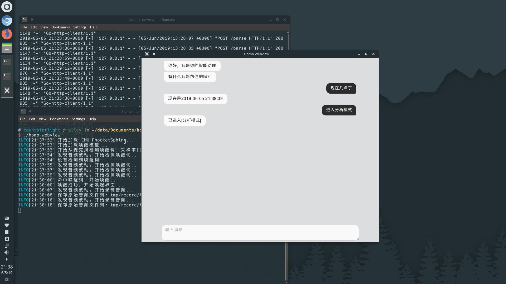

Homo
======== 

一个基于离线唤醒，自然语言理解和情感分析的开源自然交互系统

<p align="center">
  <a href="https://travis-ci.org/countstarlight/homo">
    
  </a>
  <a href="https://hub.docker.com/r/countstarlight/homo">
    
  </a>
  <a href="https://hub.docker.com/r/countstarlight/homo">
    
  </a>
  <a href="https://hub.docker.com/r/countstarlight/homo">
    
  </a>
  <a href="https://goreportcard.com/report/github.com/countstarlight/homo">
    
  </a>
  <a href="https://github.com/countstarlight/homo/blob/master/LICENSE">
    
  </a>
</p>

**演示视频(BiliBili)：**
https://www.bilibili.com/video/av54654613

[](https://www.bilibili.com/video/av54654613)

**功能**

* 离线唤醒
  * 基于开源轻量级语音识别引擎[PocketSphinx](https://github.com/cmusphinx/pocketsphinx)实现
  * 使用开源工具集[CMUCLMTK](http://www.speech.cs.cmu.edu/SLM/toolkit_documentation.html)进行离线语言模型训练
* 在线语音识别
  * 调用百度在线语音识别API
* 语音合成：
  * 调用百度在线语音合成API
* 自然语言理解
  * 基于开源自然语言理解框架[Rasa NLU](https://github.com/RasaHQ/rasa)实现
  * 采用开源信息提取工具集[MITIE](https://github.com/mit-nlp/MITIE)构建用于Rasa NLU进行实体识别和意图识别的模型
  * 意图识别分类采用开源机器学习框架[scikit-learn](https://github.com/scikit-learn/scikit-learn)
  * 中文分词采用开源分词组件[jieba](https://github.com/fxsjy/jieba)
* 文本情感分析
  * 基于支持向量机(SVM)算法进行情感极性分析
  * word2vec模型构建采用开源主题建模工具[Gensim](https://github.com/RaRe-Technologies/gensim)
  * (可选)基于逻辑回归(Logistic Regression)算法的情感极性分类器实现

**目录**

<!-- TOC -->

- [快速开始(Linux)](#快速开始linux)
- [使用指南](#使用指南)
    - [1. 意图理解范围](#1-意图理解范围)
- [自定义](#自定义)
    - [1. 自定义唤醒词](#1-自定义唤醒词)
    - [2. 扩展自然语言理解](#2-扩展自然语言理解)
- [文件结构](#文件结构)
- [发展路线](#发展路线)
- [贡献](#贡献)
- [捐赠](#捐赠)
- [协议](#协议)

<!-- /TOC -->

# 快速开始(Linux)

获取Homo源码：

```bash
git clone https://github.com/countstarlight/homo.git
```

参照文档获取Homo运行所需数据：[https://homo.codist.me/docs/dataset/](https://homo.codist.me/docs/dataset/)

确保已经安装Docker，运行(如果当前用户不在 `docker` 组里，运行 `run.sh` 需要 `root` 权限)：

```bash
cd homo
cp conf/example_app.ini conf/app.ini
./run.sh
```

这会默认从docker hub下载并启动镜像，也可以使用阿里云构建的镜像：

```bash
./run.sh -a
```

`run.sh` 支持的命令：

```bash
$ ./run.sh -h
 附加命令:
 -p/--pull      获取/更新 镜像，默认从docker hub获取，使用 '-p a' 或 '-p ali' 从阿里云获取
 -a/--aliyun    运行阿里云Docker镜像(默认运行docker hub镜像)
 -d/--debug     用于调试，会使用Docker容器内的bash，默认调试docker hub镜像，使用 '-d a' 或 '-d ali' 调试阿里云镜像
 -h/--help      显示此帮助信息
```

# Homo文档

[https://homo.codist.me/docs/](https://homo.codist.me/docs/)

## 第一步

* [安装](https://homo.codist.me/docs/install/) - 安装Homo到你的平台

* [获取数据](https://homo.codist.me/docs/dataset/) - 获取Homo运行所需的数据

* [配置](https://homo.codist.me/docs/config/) - 详细了解Homo的配置项

* [运行](https://homo.codist.me/docs/run/) - 使用不同模式启动Homo

## 使用指南

* [意图理解范围](https://homo.codist.me/docs/intent/) - Homo自带的意图理解的范围

## 进阶

* [自定义唤醒词](https://homo.codist.me/docs/wake-up/) - 自定义唤醒Homo时的唤醒词

* [扩展自然语言理解](https://homo.codist.me/docs/nlu/) - 扩展Homo能理解的自然语言的范围

# 发展路线

- [ ] 插件系统
    - [ ] 扩展行为

- [ ] 多平台支持
    - [ ] Windows
    - [ ] Macos

- [ ] 完善文档
    - [ ] 在多个平台上的编译配置
    - [x] 自定义唤醒词
    - [x] 扩展自然语言理解
    - [ ] 扩展行为

- [ ] 完善单元测试
    - [ ] 离线唤醒模块

- [ ] Python部分用Go或Rust或C++重写
    - [ ] 替代用到的机器学习库
    - [ ] 文本情感分析部分：SVM...
    - [ ] 自然语言理解部分：MITIE...

- [ ] 添加对英文的支持
    - [ ] 离线唤醒
    - [ ] 语音识别
    - [ ] 语音合成
    - [ ] 文档

# 贡献

欢迎通过 [issues](https://github.com/countstarlight/homo/issues) 提出问题和建议，或通过 [Pull Requests](https://github.com/countstarlight/homo/pulls) 向本项目提交修改

# 捐赠

如果你觉得这个项目对你有帮助，可以请作者喝一杯咖啡，支持作者持续开发


# 协议

[MIT](https://github.com/countstarlight/homo/blob/master/LICENSE)

Copyright (c) 2019-present Codist
