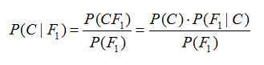
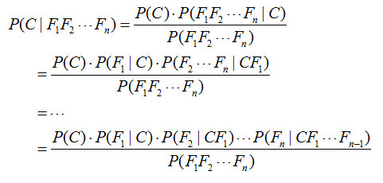
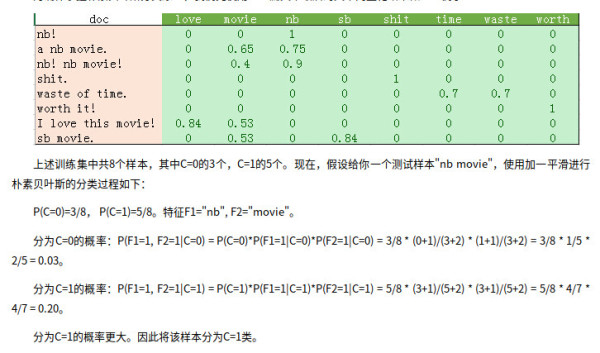
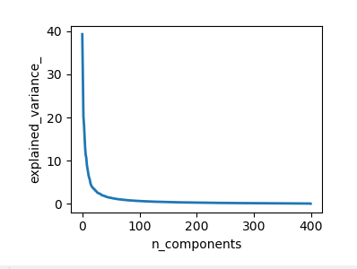

文本情感分析 
=====

<!-- TOC -->

- [1.数据准备](#1数据准备)
    - [1.1词典文件](#11词典文件)
        - [1.1.1 积极词词典A](#111-积极词词典a)
        - [1.1.2 消极词词典A](#112-消极词词典a)
        - [1.1.3 积极词和消极词词典B](#113-积极词和消极词词典b)
        - [1.1.4 连词词典](#114-连词词典)
        - [1.1.5 标点符号词典](#115-标点符号词典)
        - [1.1.6 程度副词词典](#116-程度副词词典)
        - [1.1.7 拒绝词词典](#117-拒绝词词典)
        - [1.1.8 短语句式词典](#118-短语句式词典)
        - [1.1.9 停用词词典](#119-停用词词典)
    - [1.2 语料数据](#12-语料数据)
        - [1.2.1 酒店评价数据](#121-酒店评价数据)
        - [1.2.2 外卖评价数据1](#122-外卖评价数据1)
        - [1.2.3 外卖评价数据2](#123-外卖评价数据2)
- [2.分析算法](#2分析算法)
    - [1.1 基于情感词典的情感极性分析](#11-基于情感词典的情感极性分析)
        - [1.1.1 分析算法1](#111-分析算法1)
        - [1.1.2 分析算法2](#112-分析算法2)
    - [1.2 基于K最近邻的情感极性分析](#12-基于k最近邻的情感极性分析)
        - [1.2.1 训练数据集](#121-训练数据集)
        - [1.2.2 情感分析](#122-情感分析)
    - [1.3 基于朴素贝叶斯的情感极性分析](#13-基于朴素贝叶斯的情感极性分析)
        - [1.3.1 训练数据集](#131-训练数据集)
        - [1.3.2 情感分析](#132-情感分析)
    - [1.4 基于最大熵的情感极性分析](#14-基于最大熵的情感极性分析)
    - [1.5 基于支持向量机的情感极性分析](#15-基于支持向量机的情感极性分析)
        - [1.5.1 数据清洗](#151-数据清洗)
        - [1.5.2 去除停用词](#152-去除停用词)
        - [1.5.3 训练word2vec模型](#153-训练word2vec模型)
        - [1.5.4 训练词向量](#154-训练词向量)
        - [1.5.5 标准化](#155-标准化)
        - [1.5.6 向量降维](#156-向量降维)
        - [1.5.7 模型构建](#157-模型构建)
    - [1.6 基于多层感知器的情感极性分析](#16-基于多层感知器的情感极性分析)
        - [1.6.1 语料处理](#161-语料处理)
        - [1.6.2 模型构建](#162-模型构建)
    - [1.7 算法比较](#17-算法比较)
- [2.数据处理](#2数据处理)
- [3.运行测试](#3运行测试)

<!-- /TOC -->
# 1.数据准备

对算法用到的数据进行预处理，数据包括词典文件(dictionary)和语料文件(corpus)

## 1.1词典文件

词典数据已标注情感极性，`...` 意为省略，词典文件在 `sentiment/data/dict/`下

### 1.1.1 积极词词典A

词典源于对餐饮和外卖评价的常见情感词总结及标注，适用于对餐饮行业评价的情感极性分析。

数据来自：[github.com/chaoming0625/SentimentPolarityAnalysis](https://github.com/chaoming0625/SentimentPolarityAnalysis/blob/master/spa/f_dict/positive_dict.txt)

词典文件为：`waimai/positive_dict.txt`

只包含积极词，每一行为一条数据，第一个是词，第二个是词的权重(共4554条数据)：

```
很快  1.75
还好  1.2
很萌  1.75
服务到位    1
到位    1
凑活  0.8
挺好吃  1.75
挺不错  1.75
满意  2
爱吃  2
好   2
大师傅   2
值得推荐   2
...
```

### 1.1.2 消极词词典A

词典源于对餐饮和外卖评价的常见情感词总结及标注，适用于对餐饮行业评价的情感极性分析。

数据来自：[github.com/chaoming0625/SentimentPolarityAnalysis](https://github.com/chaoming0625/SentimentPolarityAnalysis/blob/master/spa/f_dict/negative_dict.txt)

词典文件为：`waimai/negative_dict.txt`

只包含消极词，每一行为一条数据，第一个是词，第二个是词的权重(共4450条数据)：

```
无语  2
醉了  2
没法吃  2
不好  2
太差  5
太油  2.5
有些油  1
咸   1
素质太低  4
太低  3
隔夜肉 2
隔夜 2
...
```

### 1.1.3 积极词和消极词词典B

词典是从是从微博、新闻、论坛等数据来源的上百万篇情感标注数据当中自动构建得到，适用于处理社交媒体的情感分析。

数据来自：[BosonNLP数据](https://bosonnlp.com/dev/resource)

词典文件为：`BosonNLP_sentiment_score/BosonNLP_sentiment_score.txt`

包含积极词和消极词，每一行为一条数据，第一个是词，第二个是词的权重，权重大于0为积极，小于0为消极(共114,767条数据)：

```
心传心 5.28540221886
有机酸 5.28540221886
服务团 5.28540221886
深证 5.28540221886
生月超 5.28540221886
白保 5.28540221886
祝家姐 5.28540221886
笔耕不辍 5.28540221886
色织 5.28540221886
....
朝仲 -5.41616190446
MD... -5.34746092937
人清 -5.34746092937
风疹块 -5.34746092937
ＴＭＤ -5.34746092937
真桑心 -5.30440443402
延机 -5.27532412618
毛明天 -5.27532412618
....
```

### 1.1.4 连词词典

数据来自：[github.com/chaoming0625/SentimentPolarityAnalysis](https://github.com/chaoming0625/SentimentPolarityAnalysis/blob/master/spa/f_dict/conjunction_dict.txt)

词典文件为：`conjunction_dict.txt`

```
并   1.2
且   1.2
而   1.2
虽然  1.2
不过  1.2
至于  1.2
致   1.2
不料  1.2
岂知  1.2
...
```

### 1.1.5 标点符号词典

数据来自：[github.com/chaoming0625/SentimentPolarityAnalysis](https://github.com/chaoming0625/SentimentPolarityAnalysis/blob/master/spa/f_dict/punctuation_dict.txt)

词典文件为：`punctuation_dict.txt`

```
!   2
！   2
?   1.5
？   1.5
～   1.2
~   1.2
...
```

### 1.1.6 程度副词词典

既是通过打分的方式判断文本的情感正负，那么分数绝对值的大小则通常表示情感强弱。既涉及到程度强弱的问题，那么程度副词的引入就是势在必行的。词典可从[《知网》情感分析用词语集（beta版）](https://link.jianshu.com?t=http://www.keenage.com/download/sentiment.rar)下载。词典内数据格式可参考如下格式，即共两列，第一列为程度副词，第二列是程度数值，`> 1`表示强化情感，`< 1`表示弱化情感。

数据来自：[github.com/chaoming0625/SentimentPolarityAnalysis](https://github.com/chaoming0625/SentimentPolarityAnalysis/blob/master/spa/f_dict/adverb_dict.txt)

词典文件为：`adverb_dict.txt`：

```
超级  2
超  2
都   1.75
还   1.5
实在  1.75
越来越  2
再也  2
完全  2
真是  1.75
足足  1.75
大大的  1.75
巨  2
最最  2
...
```

### 1.1.7 拒绝词词典

数据来自：[github.com/chaoming0625/SentimentPolarityAnalysis](https://github.com/chaoming0625/SentimentPolarityAnalysis/blob/master/spa/f_dict/denial_dict.txt)

词典文件为：`denial_dict.txt`：

```
没敢 1
不是  1
休   1
無   1
不曾  1
未必  1
没有  1
不要  1
...
```

### 1.1.8 短语句式词典

数据来自：[github.com/chaoming0625/SentimentPolarityAnalysis](https://github.com/chaoming0625/SentimentPolarityAnalysis/blob/master/spa/f_dict/phrase_dict.txt)

词典文件为：`phrase_dict.txt`：

```
肉……老    -2

提高了……质量  2
希望……提高……质量  -1

被……吃过    -2
再也不……   -3
不会再……   -3

光送……菜    -1
只送……菜    -1
只有……菜    -1
...
```
### 1.1.9 停用词词典

停用词主要指的是一些对情感分析没有太多帮助的常见的无实际意义的词，比如说“的”。

数据来自：中科院计算所中文自然语言处理开放平台提供的有1208个停用词的中文停用词表

词典文件为：`detected_dict.txt`：

```
，
：
；
？
末##末
啊
阿
哎
哎呀
哎哟
唉
俺
俺们
按
按照
吧
吧哒
```

## 1.2 语料数据

语料数据已标注情感极性，`...` 意为省略，文件在 `sentiment/data/corpus/`下

### 1.2.1 酒店评价数据

源于网络对酒店评价数据

数据来自：[github.com/chaoming0625/SentimentPolarityAnalysis](https://github.com/chaoming0625/SentimentPolarityAnalysis/blob/master/spa/f_dict/ch_hotel_corpus.txt)

数据文件：`ch_hotel_corpus.txt`

已进行中文分词，每行开头的 `pos` 意为正面的评价，`neg` 为负面的评价：

```
pos	房间	设备	太破	,	连	喷头	都	是	不好	用	,	空调	几乎	感觉	不到	,	虽然	我开	了	最大	另外	就是	设备	维修	不	及时	,	洗澡	用品	感觉	都	是	廉价	货	,	味道	很	奇怪	的	洗头	液	等等	...	总体	感觉	服务	还	可以	,	设备	招待所	水平	...
pos	总体	感觉	不错	，	美中不足	的	是	房	与	房	之间	隔音	效果	不太好	，	还有	房价	感觉	稍	高	。
pos	设施	虽	稍	陈旧	一些	,	但	良好	的	服务	给	人	温暖	.	酒店	所	处	地理位置	和	环境	极好	.	对	年龄	较大	的	个人	旅游者	而言	,	入住	该	酒店	不失为	较佳	选择	.
pos	房间	比较	干净	，	卫生间	太小	，	转身	都	费劲	。	地理位置	一半	，	因在	胡同	里	，	不	容易	找到	。	服务	一般	。
...
neg	位置	比较	好	 	卫生条件	也	还行	 	就是	房间	太小	 	高级	大床	房	的	大床	 	还	不如	一般	酒店	的	标间	的	床	 	而且	床	实在	是	睡	的	不是	很	舒服
neg	什么	破烂	酒店	，	可以	说	是	携程	提供	酒店	里面	最差	的	了	，	而且	差到	无法形容	，	什么	都	不好	，	唯一	地段	好
neg	经济型	酒店	虽然	没有	太高	的	要求	但	房间	实在	是	太小	了	，	很	有种	做牢	的	感觉	，	如果	是	无窗	的	房间	那	就	更	糟糕	了	，	建议	大伙	不要	住	无	窗房	。
...
```

### 1.2.2 外卖评价数据1

源于网络对外卖评价数据

数据来自：[github.com/chaoming0625/SentimentPolarityAnalysis](https://github.com/chaoming0625/SentimentPolarityAnalysis/blob/master/spa/f_dict/ch_waimai_corpus.txt)

数据文件：`ch_waimai_corpus.txt`

已进行中文分词，每行开头的 `pos` 意为正面的评价，`neg` 为负面的评价：

```
pos	很快	，	棒棒	嗒
pos	汉堡	王	的	东西	感觉	比	麦当劳	肯德基	好吃	多	了
pos	真	迅速	！	很	不错	呦	！
pos	非常	好	，	比去	店里	吃	还	实惠	。	送餐	快	，	外送员	态度	也	特好	。
pos	太棒	啦	！	好吃	,	速度	很快
...
neg	油	特别	重	，	而且	不好	，	汤	不	好喝	，	米线	汤	很	重要	的	！	不过	菜	多	，	以后	豆芽	能	换成	青菜	吗	…	再吐槽	一次	油	…
neg	送餐	送	的	特别	快	，	大概	20	分钟	左右	就	到	了	，	就是	米线	没有	以前	劲	道	好吃	了	，	可能	是	定	的	太晚	，	米线	已经	吸水	膨胀	了	，	所以	才	这样	吧
neg	呵呵	，	我	11	点	40	下	的	单	，	送	的	时	已经	13	点	20	，	送来	的	米线	也	软	了	，	我	真醉	了
neg	加	两种	荤菜	但是	只	给	了	一个
neg	5	块钱	一份	的	鹌鹑蛋	居然	只有	2	个	。	。	。
...
```

### 1.2.3 外卖评价数据2

源于网络对外卖评价数据

数据来自：[github.com/chaoming0625/SentimentPolarityAnalysis](https://github.com/chaoming0625/SentimentPolarityAnalysis/blob/master/spa/f_dict/ch_waimai2_corpus.txt)

数据文件：`ch_waimai2_corpus.txt`

已进行中文分词，每行开头的 `pos` 意为正面的评价，`neg` 为负面的评价：

```
neg	菜品	质量	好	，	味道	好	，	就是	百度	的	问题	，	总是	用	运力	原因	来	解释	，	我	也	不	懂	这	是	什么	原因	，	晚	了	三个	小时	呵呵	厉害	吧	！	反正	订	了	就	退	不了	，	只能	干	等	…	…
neg	分量	还	可以	…	…	就是	有点	没	特色	…	…	下回	不吃	啦
neg	没什么	味道	，	送来	的	晚凉	了
...
pos	味道	蛮	好	的	，	鸡蛋	煎成	了	花	的	形状	好	可爱
pos	送餐	小哥	好帅	好帅	！	！	他	说	希望	给	好评	那	就	一定	是	好评	好评	！	！
pos	活动	挺	好	、	希望	继续	保持
pos	送	餐员	辛苦	了	！	可能	不要	同时	点	肥牛	和	鸡	排会	更好	，	点	在	一起	有点	腻	。	味道	还是	不错	的	。
pos	还	不错	，	肥牛	有点	干	。
pos	挺	精致	的	午餐	、	百度	快递	不错	、	很快	！
...
```

# 2.分析算法

## 1.1 基于情感词典的情感极性分析

### 1.1.1 分析算法1

**1.首先对数据进行分句**

用正则表达式分别对`是……不是……` 和 `要是|如果……就好了` 句式进行识别，并配合标点符号进行进行分句处理

**2.对分句进行情感分析**

句子的情感值记为`score`，初始为`0`，先用`jieba`对句子进行分词

用正则表达式分别对 `如果……就好了`，`是…不是…` 以及根据短语句式词典文件对短语句式进行识别，如果句式表否定，减去对应句式的值，短语句式直接加上句式对应的值，将短语句式中出现的短语从分词结果中剔除，防止产生干扰

**3.对分词进行情感分析**

用之前的词典文件对词判断词性：连词，标点符号，积极还是消极；对于积极和消极的词汇直接加上或减去在词典文件中对应的值，对于连词和标点符号，统一进行连乘计算

**4.得出整体极性判断**

将所有分句的`score`相加，正表示积极，否则为消极

### 1.1.2 分析算法2

## 1.2 基于K最近邻的情感极性分析

K最近邻(kNN, K-Nearest Neighbours)分类算法，如果一个样本在特征空间中的k个最相似(即特征空间中最邻近)的样本中的大多数属于某一个类别，则该样本也属于这个类别。

### 1.2.1 训练数据集

使用[酒店评价数据](#121-酒店评价数据)，[外卖评价数据1](#122-外卖评价数据1)和[外卖评价数据2](#123-外卖评价数据2)

### 1.2.2 情感分析

依据对文本的标注`pos`还是`neg`，将文本分为两类，分别计算词向量(得到不同词的个数，构建词向量)，得到的所有词向量组成一个向量组

将待分析的文本也转为词向量，依次计算与训练出的词向量组中每个词向量的距离：

$E(x,y)=\sqrt{\sum_{i=0}^{n}(x_i^2 - y_i^2)}$

对得到的距离排序，依据设定的 `k`值将距离排序前 `k` 个对应词向量情感极性进行统计，积极大于消极则结果为积极，否则为消极

## 1.3 基于朴素贝叶斯的情感极性分析

朴素贝叶斯（Native Bayes）分类算法，基于贝叶斯定理与特征条件独立假设的分类方法。

**1.贝叶斯定理**

假设对于某个数据集，随机变量C表示样本为C类的概率，F1表示测试样本某特征出现的概率，套用基本贝叶斯公式，则如下所示：

$$P(C|F_1)=\frac{P(CF_1)}{P(F_1)}=\frac{P(C)\cdot P(F_1|C)}{P(F_1)})$$



表示对于某个样本，特征F1出现时，该样本被分为C类的条件概率

举例来说，有个测试样本，其特征F1出现了（F1=1），那么就计算P(C=0|F1=1)和P(C=1|F1=1)的概率值。前者大，则该样本被认为是0类；后者大，则分为1类。

**先验概率（Prior）**：P(C)是C的先验概率，可以从已有的训练集中计算分为C类的样本占所有样本的比重得出。

**证据（Evidence）**：即上式P(F1)，表示对于某测试样本，特征F1出现的概率。同样可以从训练集中F1特征对应样本所占总样本的比例得出。

**似然（likelihood）**：即上式P(F1|C)，表示如果知道一个样本分为C类，那么他的特征为F1的概率是多少。

对于多个特征而言，贝叶斯公式可以扩展如下：



**2.朴素的概念**

为了简化计算，朴素贝叶斯算法做了一假设：“朴素的认为各个特征相互独立”。这么一来，上式的分子就简化成了：

$P(C)P(F1|C)P(F2|C)...P(Fn|C)$

这个假设是认为各个特征之间是独立的，看上去确实是个很不科学的假设。因为很多情况下，各个特征之间是紧密联系的。然而在朴素贝叶斯的大量应用实践实际表明其工作的相当好。

其次，由于朴素贝叶斯的工作原理是计算P(C=0|F1...Fn)和P(C=1|F1...Fn)，并取最大值的那个作为其分类。而二者的分母是一模一样的。因此，我们又可以省略分母计算，从而进一步简化计算过程。

另外，贝叶斯公式推导能够成立有个重要前期，就是各个证据（evidence）不能为0。也即对于任意特征Fx，P(Fx)不能为0。而显示某些特征未出现在测试集中的情况是可以发生的。因此实现上通常要做一些小的处理，例如把所有计数进行+1（加法平滑 additive smoothing，又叫拉普拉斯平滑 Laplace smothing）。而如果通过增加一个大于 0 的可调参数 alpha 进行平滑，就叫 Lidstone 平滑。



### 1.3.1 训练数据集

使用和基于K最近邻的情感极性分析相同的，已分词的积极和消极情感数据集

### 1.3.2 情感分析

将词按照积极和消极分成两个数组，统计每个词在训练数据中出现的次数，并统计积极和消极数组的长度

将待测试的文本分词后，按照上述定理计算得到分类

## 1.4 基于最大熵的情感极性分析

## 1.5 基于支持向量机的情感极性分析

支持向量机（Support Vector Machine, SVM）是一类按监督学习（supervised learning）方式对数据进行二元分类（binary classification）的广义线性分类器（generalized linear classifier），其决策边界是对学习样本求解的最大边距超平面（maximum-margin hyperplane）

使用[酒店评价数据](#121-酒店评价数据)，[外卖评价数据1](#122-外卖评价数据1)和[外卖评价数据2](#123-外卖评价数据2)

### 1.5.1 数据清洗

清除文本中的特殊字符、英文字符、标点和数字等，相当于只提取中文：

```python
# extract Chinese words
chinese_pattern = '[\u4e00-\u9fa5]+'
chi_word_list = re.findall(chinese_pattern, line)
```

### 1.5.2 去除停用词

停用词主要指的是一些对情感分析没有太多帮助的常见的无实际意义的词，比如说“的”。

```python
    def clean_detected_words(self, cutted_list):
        """
        Remove detected words
        :param cutted_list:
        :return:
        """
        detected_list = []
        with open('data/dict/detected_dict.txt', 'r', encoding='utf-8', errors='ignore') as f:
            detected_list = f.readlines()

        # Delete the last'\n'of each line
        for i in range(0, len(detected_list)):
            detected_list[i] = detected_list[i][:-1]

        detected_dics = {}.fromkeys(detected_list, 1)
        result = []
        for cutted in cutted_list:
            if cutted not in detected_dics:
                result.append(cutted)
        return result
```

### 1.5.3 训练word2vec模型

使用[gensim](https://link.jianshu.com/?t=http://radimrehurek.com/gensim/)的word2vec进行词向量的训练：

```python
def csv2vec(csv_file, model_file):
    corpus = word2vec.Text8Corpus(csv_file)
    model = word2vec.Word2Vec(corpus, size=400)

    # Save models to file
    model.save(model_file)
```

### 1.5.4 训练词向量

采用Word2Vec算法进行向量化的操作

```python
def buildVecs(filename, model,debug):  
    """
    输入文件名，首先进行数据清洗，然后利用word2vec获得他们的向量化表示，
    :param filename:
    :param model:
    :return:
    """
    with open(filename, 'r',encoding='utf-8',errors='ignore') as f:
        # print txtfile
        content = f.read().replace("\n", '').strip()
        cleaner = CleanDatas.CleanDatas()
        content = cleaner.clean(content)
        seg = jieba.cut(content, cut_all=False)
        s = '-'.join(seg)
        seg_list = s.split('-')
        if len(cleaner.clean_detected_words(seg_list)) > 0:
            seg_list = cleaner.clean_detected_words(seg_list)
        result = []
        for i in seg_list:
            if i in model:
                result.append(model[i])
        array_mean=0.0
        if len(result) != 0:
            array_mean = sum(np.array(result))/len(result)
        else:
            print(debug)
        return array_mean
```

### 1.5.5 标准化

使用`sklearn`的`scale`进行标准化：

```python
# standardization
X = scale(X)  
```

### 1.5.6 向量降维

我们使用word2vec算法训练出的向量都是400维的，其实这其中有很多维度对于最终的结果影响并不大，我们可以适当的删除一些从而提高效率和准确率。这里使用的方法是PCA（主成分分析法）,这里使用的是sklearn工具包中的PCA组件。

```python
#无监督使用PCA训练X
pca = PCA(n_components=400)  
pca.fit(X)  
#创建图表并指定图表大小
# figsize: w,h tuple in inches
plt.figure(1, figsize=(4, 3))  
plt.clf()  
plt.axes([.2, .2, .7, .7])  
plt.plot(pca.explained_variance_, linewidth=2)  
plt.axis('tight')  
plt.xlabel('n_components')  
plt.ylabel('explained_variance_')  
plt.show()
```

可以得到下图：



PCA算法会自动根据特征的重要性重新排序，我们可以看到重新排序之后的前100维度数据基本可以涵盖所有的信息了，所以我们就可以降维到100维：

```python
#由图知我们保留前100维的数据
X_reduced = PCA(n_components = 100).fit_transform(X)  
```
### 1.5.7 模型构建


在训练前我们需要简单的将数据分成训练集和测试集。

```python
#分割训练集和测试集,选取500负和1000正作为测试集
X_reduced_train = X_reduced[0:2500]  
X_reduced_train = np.concatenate((X_reduced_train,X_reduced[3000:9000]))  
y_reduced_train = Y[0:2500]  
y_reduced_train = np.concatenate((y_reduced_train,Y[3000:9000]))  
X_reduced_test = X_reduced[2500:3000]  
X_reduced_test = np.concatenate((X_reduced_test,X_reduced[9000:10000]))  
y_reduced_test = Y[2500:3000]  
y_reduced_test = np.concatenate((y_reduced_test,Y[9000:10000]))  
```

使用sklearn中是SVM模块，核函数选用线性函数。

```python
#构建SVM模型
clf = SVC(C = 2, probability = True, kernel='linear')

clf.fit(X_reduced_train, y_reduced_train)  
print('Test Accuracy: %.5f'% clf.score(X_reduced_test, y_reduced_test))

print("test:")  
print(clf.predict(X_reduced_test))  
print("value:")  
print(y_reduced_test)  
```

这样一来我们的程序便可以运行，最后会输出准确率。

**SVM (RBF) + PCA**

SVM (RBF)分类表现更为宽松，且使用**PCA**降维后的模型表现有明显提升，misclassified多为负向文本被分类为正向文本，其中`AUC = 0.92`，`KSValue = 0.7`。
 关于SVM的调参可以参考笔者的另一篇文章[Python利用Gausian Process对Hyper-parameter进行调参](https://www.jianshu.com/p/90e6abdeb4f2)

```python
"""
2.1 SVM (RBF)
    using training data with 100 dimensions
"""

clf = SVC(C = 2, probability = True)
clf.fit(X_reduced_train, y_reduced_train)

print 'Test Accuracy: %.2f'% clf.score(X_reduced_test, y_reduced_test)

pred_probas = clf.predict_proba(X_reduced_test)[:,1]
print "KS value: %f" % KSmetric(y_reduced_test, pred_probas)[0]

# plot ROC curve
# AUC = 0.92
# KS = 0.7
fpr,tpr,_ = roc_curve(y_reduced_test, pred_probas)
roc_auc = auc(fpr,tpr)
plt.plot(fpr, tpr, label = 'area = %.2f' % roc_auc)
plt.plot([0, 1], [0, 1], 'k--')
plt.xlim([0.0, 1.0])
plt.ylim([0.0, 1.05])
plt.legend(loc = 'lower right')
plt.show()

joblib.dump(clf, "SVC.pkl")
```

## 1.6 基于多层感知器的情感极性分析

多层感知器（Multilayer Perceptron, MLP）是一种前向结构的人工神经网络，映射一组输入向量到一组输出向量。MLP可以被看做是一个有向图，由多个节点层组成，每一层全连接到下一层。除了输入节点，每个节点都是一个带有非线性激活函数的神经元（或称处理单元）。

MLP相比于SVM (RBF)，分类更为严格，PCA降维后对模型准确率影响不大，misclassified多为正向文本被分类为负向，其实是更容易overfitting，原因是语料过少，其实用神经网络未免有些小题大做，`AUC = 0.91`。

### 1.6.1 语料处理

语料处理和词向量训练过程和[基于SVM的情感极性分析](#15-基于svm的情感极性分析)相同

### 1.6.2 模型构建

```python
"""
2.2 MLP
    using original training data with 400 dimensions
"""
model = Sequential()
model.add(Dense(512, input_dim = 400, init = 'uniform', activation = 'tanh'))
model.add(Dropout(0.5))
model.add(Dense(256, activation = 'relu'))
model.add(Dropout(0.5))
model.add(Dense(128, activation = 'relu'))
model.add(Dropout(0.5))
model.add(Dense(64, activation = 'relu'))
model.add(Dropout(0.5))
model.add(Dense(32, activation = 'relu'))
model.add(Dropout(0.5))
model.add(Dense(1, activation = 'sigmoid'))

model.compile(loss = 'binary_crossentropy',
              optimizer = 'adam',
              metrics = ['accuracy'])

model.fit(X_train, y_train, nb_epoch = 20, batch_size = 16)
score = model.evaluate(X_test, y_test, batch_size = 16)
print ('Test accuracy: ', score[1])

pred_probas = model.predict(X_test)
# print "KS value: %f" % KSmetric(y_reduced_test, pred_probas)[0]

# plot ROC curve
# AUC = 0.91
fpr,tpr,_ = roc_curve(y_test, pred_probas)
roc_auc = auc(fpr,tpr)
plt.plot(fpr, tpr, label = 'area = %.2f' % roc_auc)
plt.plot([0, 1], [0, 1], 'k--')
plt.xlim([0.0, 1.0])
plt.ylim([0.0, 1.05])
plt.legend(loc = 'lower right')
plt.show()
```

## 1.7 算法比较

|    算法    | 准确率  |               优点               |           缺点           |
| :--------: | :-----: | :------------------------------: | :----------------------: |
|  情感词典  |  80%+   |      算法易于理解，准确率高      |       人工工作量大       |
|  K最近邻   | 60%~70% |        算法简单，易于理解        | 准确率低；耗内存；耗时间 |
| 朴素贝叶斯 | 70%~80% | 简单，高效，运算速度快，扩展性好 |  准确率不高，达不到实用  |
|   最大熵   |  83%+   |             准确率高             |        训练时间久        |
|    SVM     |   85%   |             准确率高             |         训练耗时         |

# 2.数据处理

# 3.运行测试

